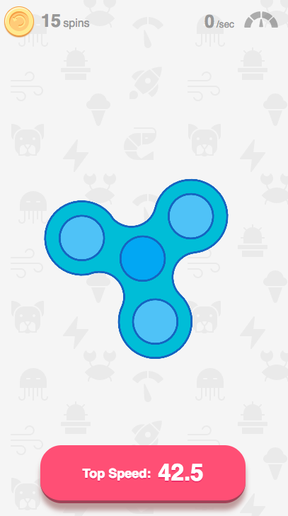

Fidget Spin
====

##### A progressive fidget spin app.

Play it live [fidgetspin.xyz](https://www.fidgetspin.xyz)

Made by the amazing [Susie Lu](https://github.com/susielu), [Paul Irish](https://github.com/paulirish), and [Pavel Feldman](https://github.com/pavelfeldman), and Sam

[](https://www.fidgetspin.xyz/)


### Dev

```sh
yarn build # builds once

yarn watch # does typescript autorecompile
yarn watch-css # does autoprefixer autorecompile

yarn start # starts static server on 80

yarn run # to see other options
```

Travis will autodeploy to `gh-pages` when `master` is updated.
